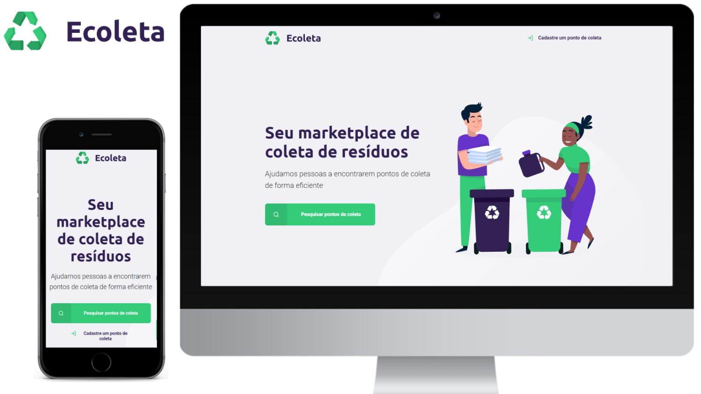

 
          

 

  
 

 
 ## Sobre
 
 Ecoleta é um sistema desenvolvido durante a semana **Next Level Week 1ª edição trilha #Starter** para cadastrar e localizar pontos de coleta de resíduos especiais.
 
 ### Iniciando o projeto
 
 * Para iniciar o projeto, primeiro clone este repositório e instale as depedências do projeto utilizando o comando `npm install`.
 * Em seguida, rode o comando `npm start` para ter acesso ao site, e digite o endereço *localhost:3000* em seu navegador.  
 
 ### Descrição
 
 As tecnologias que foram utilizadas nesse projeto foram:
 
 ✔ HTML
 
 ✔ CSS
 
 ✔ JavaScript
 
 ✔ Express
 
 ✔ SQLite
 
 ✔ Nunjucks
 
 Foram trabalhados conceitos de responsividade no CSS, fazendo com que o site seja acessível para Mobile.
 
 #### Tela Inicial (Web on Desktop + Web on Mobile):
 
